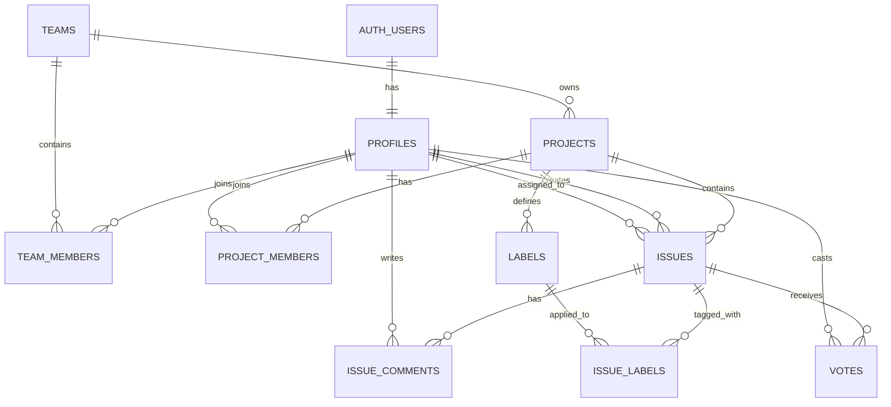

# Fluxa


**Fluxa** is a lightweight, open-source issue, bug, and feature proposal tracker built with **React** and **Supabase**.

> *Progress, tracked.*

Fluxa focuses on clarity and speed: track what’s active, what’s completed, and who’s working on what  without overcomplicating workflows.

---

## Features

* **Teams & Members**

  * Users can belong to multiple teams
  * Role-based access (`owner`, `admin`, `member`)

* **Projects**

  * Projects live under teams
  * Optional project-level membership for fine-grained permissions

* **Issues**

  * Bugs, features, and proposals
  * Simple lifecycle using `is_active`
  * Assignment, priority, and timestamps

* **Comments**

  * Discussion and collaboration per issue

* **Labels**

  * Organize and filter issues within projects

* **Voting**

  * Vote on features and proposals

* **Realtime-ready**

  * Built on Supabase for realtime updates and auth

---

## Tech Stack

* **Frontend:** React
* **Backend / Database:** Supabase (PostgreSQL)
* **Authentication:** Supabase Auth
* **Realtime:** Supabase subscriptions

---

## Database Structure

### Conceptual Hierarchy

```
auth.users
└─ profiles
   └─ team_members → teams
                      └─ projects
                           └─ issues
                                ├─ issue_comments
                                ├─ labels → issue_labels
                                └─ votes
```

---

## Database Diagram

> This diagram reflects the **current Fluxa schema**, including teams and optional project-level membership.



---

## Issues Model

Fluxa intentionally uses a simplified issue lifecycle.

* `is_active = true` → active (open / in progress)
* `is_active = false` → completed / closed

Optional:

* `completed_at` tracks when an issue was completed

This keeps the MVP simple while allowing future expansion into full status workflows.

---

## Roles

Roles are enforced at the database level using a PostgreSQL enum:

* `owner`
* `admin`
* `member`

Used consistently across:

* `team_members`
* `project_members`

---

## Getting Started

### 1. Clone the repository

```bash
git clone https://github.com/your-username/Fluxa.git
cd Fluxa
```

### 2. Install dependencies

```bash
npm install
```

### 3. Set up Supabase

1. Create a new Supabase project
2. Run the SQL schema located in `supabase/schema.sql`
3. Enable email or OAuth authentication
4. Copy your project URL and anon key

### 4. Configure environment variables

Create a `.env` file:

```env
VITE_SUPABASE_URL=your_project_url
VITE_SUPABASE_ANON_KEY=your_anon_key
```

### 5. Start the development server

```bash
npm run dev
```

---

## Roadmap

* Realtime issue updates
* Activity / audit log
* File attachments
* Roadmap and milestones
* Advanced permissions
* Full status workflows (Kanban)

---

## Contributing

Fluxa is open source and evolving.

* Open an issue for bugs or feature ideas
* Fork the repo and submit a pull request
* Keep changes focused and well-documented

Contributions are welcome ❤️

---

## License

MIT License

---

## Philosophy

Fluxa is built with a bias toward:

* Simplicity over configuration
* Shipping over perfection
* Clear data models
* Easy future evolution

Track progress. Stay focused.
**Fluxa.**

---

If you want next, I can:

* Generate `CONTRIBUTING.md`
* Add a `SECURITY.md`
* Create a **migration plan** from `is_active` → full statuses
* Turn the Mermaid diagram into a **PNG/SVG**

Just tell me what’s next 🚀
